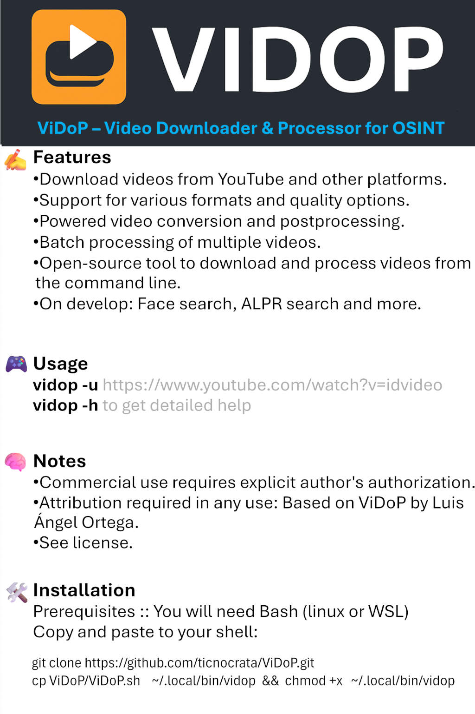

# 🎬 ViDoP – Video Downloader & Processor



**ViDoP** es una herramienta en Bash para descargar y procesar videos desde múltiples plataformas, de forma automatizada, rápida y potente.

> Descarga videos, extrae fotogramas y realiza postprocesamiento OSINT de forma automática y eficiente.  
> Automatically download videos, extract frames, and perform OSINT postprocessing with speed and simplicity.

---

## ✨ Características

- ✅ Descarga desde YouTube, Vimeo y más 
- 🎥 Conversión y edición de video 
- 🛠️ Soporte para múltiples formatos y calidad
- 📁 Procesamiento por lotes
- 🔒 Diseñado con enfoque OSINT

---

## 🧰 Instalación

### Requisitos

- Bash
- `curl`, `base64`, `jq`, `yt-dlp`, `ffmpeg`

### Instalación rápida

```bash
curl -sSL https://github.com/ticnocrata/ViDoP/releases/latest/download/ViDoP.sh -o /usr/local/bin/vidop
chmod +x /usr/local/bin/vidop
```

---

## ⚙️ Uso básico

```bash
vidop -u "https://www.youtube.com/watch?v=XXXXXX"

consulte vidop -h para la ayuda
```

---

## 📜 Licencia

Este proyecto se distribuye bajo una **licencia personalizada**:

- ✅ **Uso libre y no comercial**
- ❌ **Uso comercial requiere licencia expresa del autor**
- 🧾 **Citación obligatoria** en todo uso:

> "Basado en ViDoP de Luis Ángel Ortega – https://github.com/ticnocrata/ViDoP"

Consulta [`LICENSE.txt`](LICENSE.txt) para los términos completos.

---

## 💼 ¿Quieres usar ViDoP con fines comerciales?

[](mailto:lortegag@qosconsultores.com?subject=Licencia%20comercial%20ViDoP)

---

## 🙌 Créditos

Desarrollado por **Luis Ángel Ortega**  
GitHub: [@ticnocrata](https://github.com/ticnocrata)  
LinkedIn: [linkedin.com/in/ortgas](https://linkedin.com/in/ortgas)  
Correo: `lortegag@qosconsultores.com`

---
